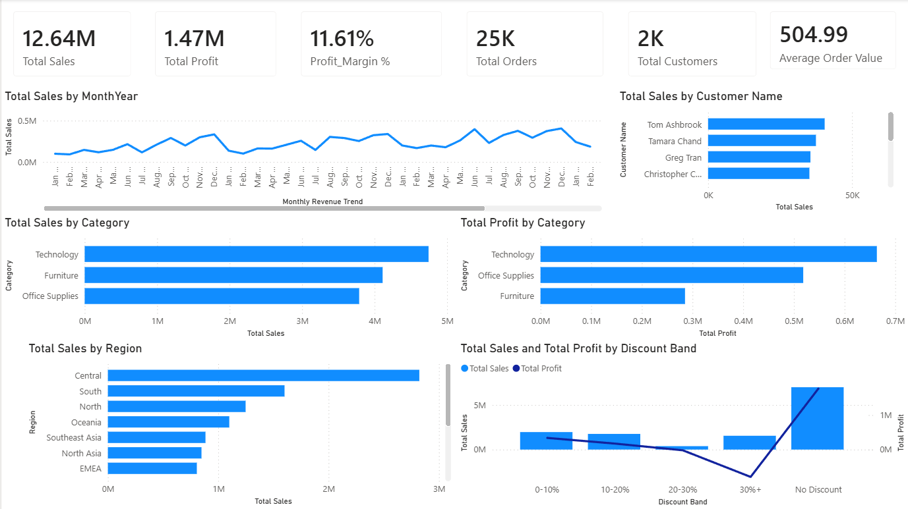

# E-Commerce Sales Intelligence Dashboard

## Project Overview

This project analyzes over 51,000 global retail transactions to uncover business insights related to revenue, profitability, customer behavior, product performance, and regional sales trends.

The objective was to build an executive-level Business Intelligence dashboard using Python, SQL, and Power BI.

---

## Business Problem

Retail companies often generate strong revenue but struggle to maximize profitability due to discounting strategies, product mix, and regional performance differences.

This project answers the following business questions:

* Which product categories drive the highest revenue and profit?
* Which customers contribute the most revenue?
* How do discounts impact profitability?
* Which regions perform best?
* What actions can improve overall profit margins?

---

## Tools & Technologies

* Python
* Pandas
* NumPy
* MySQL
* Power BI
* GitHub

---

## Dataset Information

**Dataset:** Global Superstore

* Records: 51,290
* Features: 30
* Scope: Global retail transactions

---

## Data Cleaning & Feature Engineering

Performed using Python and Pandas.

Key steps:

* Missing value validation
* Duplicate checks
* Date formatting
* Shipping Days calculation
* Profit Margin (%) calculation
* Month-Year feature creation
* Discount Band categorization

---

## SQL Analysis

Key SQL concepts implemented:

* Aggregations
* GROUP BY
* HAVING
* ORDER BY
* Window Functions
* Customer Ranking using RANK()
* Product Performance Analysis
* Regional Performance Analysis

---

## Dashboard KPIs

* Total Sales: $12.64M
* Total Profit: $1.47M
* Profit Margin: 11.61%
* Total Orders: 25K
* Total Customers: 1,590
* Average Order Value: $505

---

## Key Business Insights

### Technology Drives Business Growth

Technology generated the highest sales and profit among all product categories.

### Heavy Discounting Hurts Profitability

Products discounted above 30% generated revenue but resulted in significant profit loss.

### Consumer Segment Leads Revenue

Consumer customers contributed the largest share of total sales.

### Regional Profitability Varies

Some regions generated strong revenue but delivered comparatively lower profits, indicating optimization opportunities.

---

## Dashboard Preview


---

## Business Recommendations

* Reduce excessive discounting above 30%
* Focus on expanding high-margin technology products
* Strengthen retention strategies for top customers
* Investigate low-profit regions and categories
* Monitor discount effectiveness using profitability KPIs

---

## Project Structure

```text
E-Commerce-Sales-Intelligence-Dashboard

├── data
├── dashboard
├── notebooks
├── sql
└── README.md
```

---

## Author

Bheemendra Kumar

Aspiring Data Analyst | Python | SQL | Power BI
